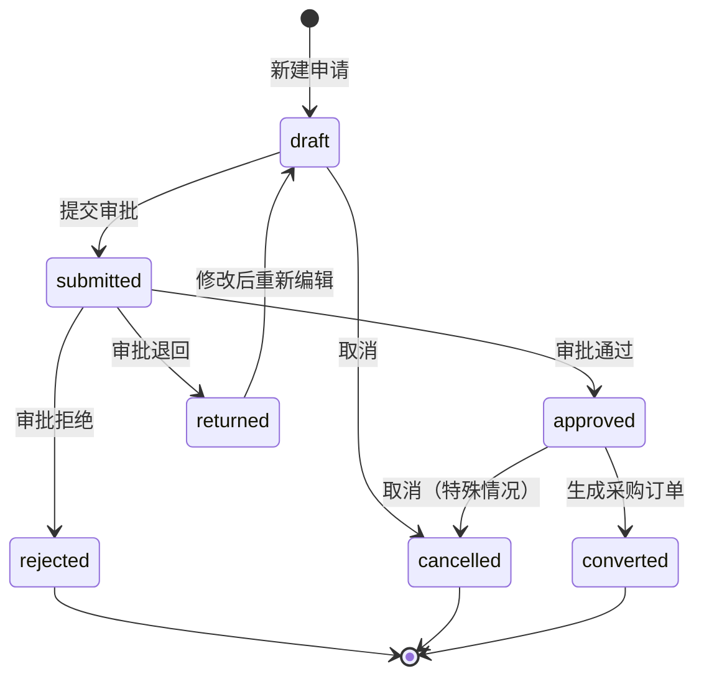
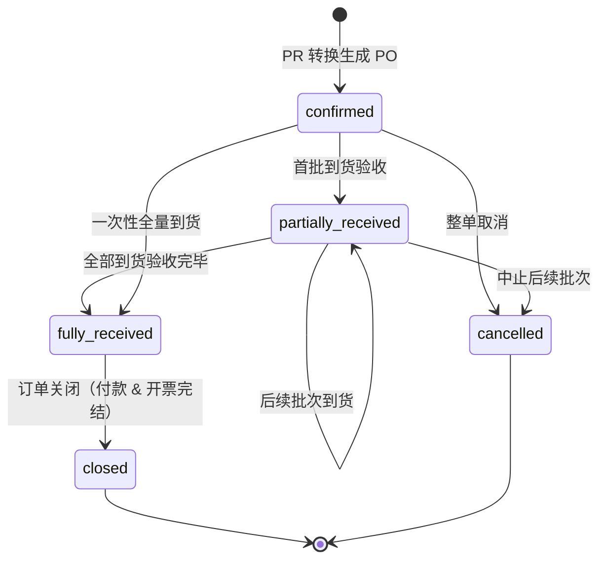
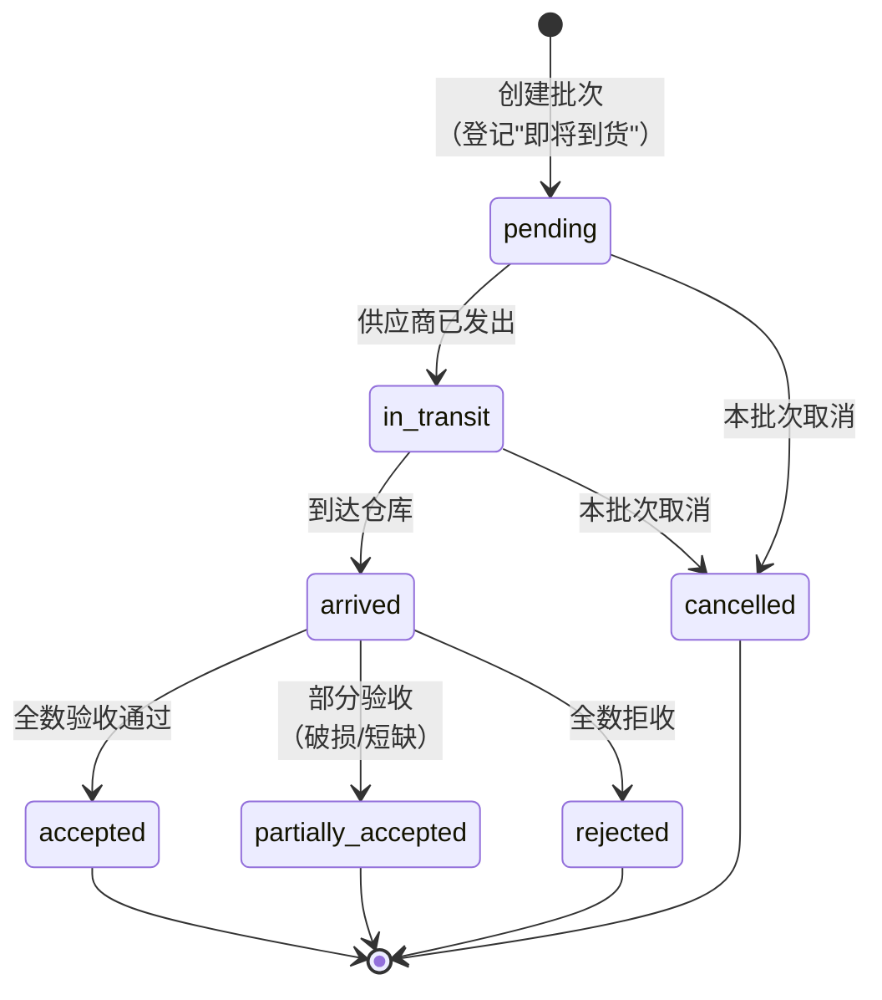
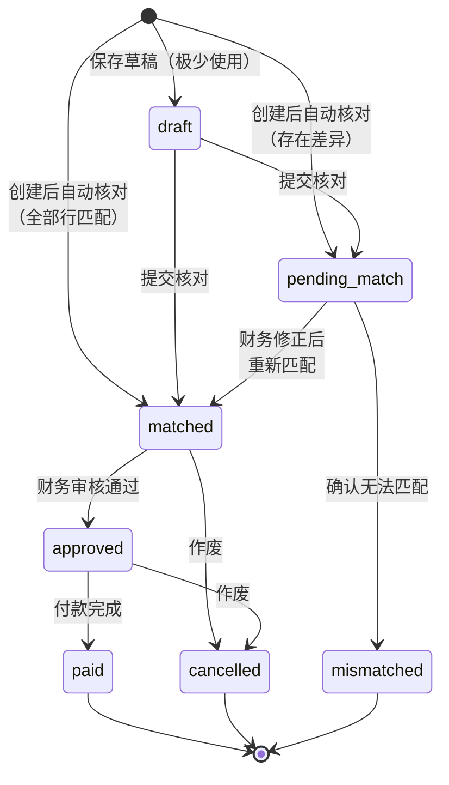
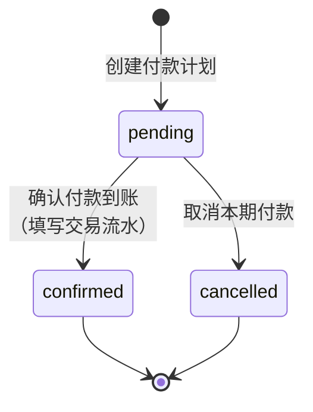

# 第 2 章｜全局业务工作流

> Mica（觅采）用户手册 · 第 2 章

一笔采购从"想买"到"钱付出去"，在 Mica 里要经过六道关卡：**采购申请 → 审批 → 采购订单 → 交货批次 →（可选）合同 → 发票 → 付款**。你可以把它想成一条生产流水线——上游是你写下的需求，下游是财务打出的款项；中间每个工位都会对这批"料"做一次加工和质检，合格才放行到下一站，不合格就退回返工。本章用**一位 IT 同事采购 MacBook Pro**的完整案例，带你走一遍流水线上的每一站。

## 全局主线一图胜千言

完整版流程图请看 [`_diagrams.md#全局业务主线`](./_diagrams.md#1-全局业务主线)，也可以在本页直接查看简化版：

> 合同（Contract）是 **可选节点**。对于金额较大、条款复杂的采购，会在 PO 生成后补签；对于标品小额采购（如本章案例中的 MacBook），通常跳过此节点。

### 本章贯穿案例

> **IT 部门的 Alice**（角色：`it_buyer`）需要为三位新入职的工程师采购 **3 台 MacBook Pro 16"**，供应商为"联想神州数码"，单价 ¥22,000，总额 **¥66,000**。

下面你将看到 Alice 如何在六个阶段里推动这笔采购。你自己发起的采购会走完全一样的流程。

---

## 阶段 1：采购申请（PR）

### 目的

在 Mica 里**正式登记一次采购需求**。你不是在"下单"，而是在写一份给公司的申请：说明要买什么、买多少、为什么买、希望什么时候到。只有经过登记的需求，才能进入后续审批和执行流程。

### 参与角色

| 动作 | 谁能做 |
| :--- | :--- |
| 新建、编辑、提交 PR | IT 采购员（`it_buyer`）、管理员（`admin`） |
| 在本部门范围内查看 PR | 部门负责人（`dept_manager`） |
| 查看全部 PR（只读） | 采购经理（`procurement_mgr`）、财务审核（`finance_auditor`） |

### 关键字段

- **`title`（标题）**：一句话概括本次采购。示例：*"IT 部新员工 MacBook Pro 采购（3 台）"*。
- **`business_reason`（业务说明）**：为什么要买。写得清楚，审批人就不会追问。
- **`required_date`（所需日期）**：你期望货到的日期，采购经理据此安排优先级。
- **行项 `supplier_id`（供应商）**：每一行明细必须指明供应商（见下方"常见问题"）。

### 状态转换

> 完整版见 [`_diagrams.md#采购申请（PR）状态机`](./_diagrams.md#2-采购申请pr状态机)。

### Alice 怎么做

1. Alice 登录 Mica，在仪表盘点击"新建采购申请"。
2. 填写标题 *"IT 部新员工 MacBook Pro 采购（3 台）"*，业务说明 *"3 位新入职工程师开发机，型号与现有团队保持一致以便统一运维"*，所需日期 `2026-05-10`。
3. 添加一行明细：物料=MacBook Pro 16"、数量=3、单价=22000、供应商=联想神州数码。系统自动计算 `amount = 66000`、`total_amount = 66000`。
4. 点击"保存"—— PR 状态为 `draft`（草稿），此时还可以随时修改。
5. 检查无误后点击"提交审批"—— PR 状态变为 `submitted`，进入阶段 2。

### 常见问题

**Q1：我的 PR 被"退回（returned）"了，怎么办？**

"退回"意味着审批人看到了但要你改点东西再来。Mica 会把这条 PR 重新打开让你编辑（状态回到 `draft`）。你在原表单上修改完（例如把单价改低、把供应商换一家），再点一次"提交审批"即可——**不需要新建一张 PR**，审批历史与备注都保留。

**Q2：我的 PR 被"拒绝（rejected）"了，还能救吗？**

"拒绝"是终态，这张 PR 已经终结，无法再提交。如果后续仍要采购，请**新建一张 PR**，并在业务说明里回应上次被拒的原因。

---

## 阶段 2：审批

### 目的

让具备决策权的同事对这笔开支拍板。审批人要判断：这个需求合理吗？金额与市场价相符吗？预算覆盖得住吗？审批结果有三种：**批准**、**退回**（要求补充/修改）、**拒绝**（终态）。

### 参与角色

| 动作 | 谁能做 |
| :--- | :--- |
| 审批 PR | 由系统按金额自动分配；不可手动转办 |
| 查看审批历史 | 申请人、审批人、管理员、财务审核、采购经理 |

审批人由系统按以下规则自动匹配（实现于 `backend/app/services/approval.py` 第 20–46 行）：

| 条件 | 审批人 |
| :--- | :--- |
| PR 总金额 **≥ ¥100,000** | **采购经理**（`procurement_mgr`） |
| PR 总金额 **< ¥100,000** | 申请人**同部门的部门负责人**（`dept_manager`） |
| 未找到对应角色（罕见） | 兜底由**管理员**（`admin`）审批 |

> 当前版本仅有**单级审批**（`total_stages = 1`）。多级审批（如大额走"部门负责人 → 采购经理 → 财务总监"）在**规划中 v0.5+**。

### 关键字段

- **`status`**：`submitted`（待审批）/ `approved` / `rejected` / `returned`。
- **`decided_by_id`**：最终做出审批决定的那个人，系统自动填写。
- **`decision_comment`**：审批意见。审批人强烈建议写，尤其是退回或拒绝时。

### 状态转换

审批本身不是独立实体，而是 PR 的一个阶段；状态机复用阶段 1 的 PR 状态机——重点关注 `submitted → approved / rejected / returned` 三条路径。

### Alice 怎么做

1. Alice 的 PR 总额为 **¥66,000 < ¥100,000**，系统自动将审批任务路由给她所在 IT 部的部门负责人 **Bob**。
2. 如果 Alice 买的是 **5 台** MacBook（¥110,000），则会自动路由给**采购经理**，不会经过 Bob。
3. Alice 无需做任何事，只需等待：在仪表盘顶部会有"审批中"的角标提示。
4. 若 Bob 批准，Alice 的 PR 进入 `approved` 状态，自动进入阶段 3 的准备工作。
5. 若 Bob 退回，Alice 会在仪表盘看到"需要修改"的提示（见阶段 1 Q1）。

### 常见问题

**Q1：为什么我看不到自己 PR 的审批人是谁？**

Mica 会在提交成功后在 PR 详情页显示当前处理人姓名（如 *"等待 Bob（IT 部负责人）审批"*）。如果看不到，多半是浏览器缓存，刷新即可。

**Q2：我发现审批人太忙，迟迟不处理，能催吗？**

可以直接当面/消息提醒。系统层面的**自动催办与飞书推送**在**规划中 v0.5+**。

---

## 阶段 3：采购订单（PO）

### 目的

把**已被批准的采购意向**正式转化为**对供应商的订单**。PR 回答"我们想买什么"，PO 回答"我们已经跟供应商敲定了什么"。PO 一旦生成，就成为后续收货、开票、付款所有动作的**唯一对账依据**。

### 参与角色

| 动作 | 谁能做 |
| :--- | :--- |
| 将 PR 转 PO | 原 PR 申请人、管理员 |
| 查看 PO | 申请人、采购经理、财务审核、管理员 |
| 查看（本部门范围，字段受限） | 部门负责人 |

### 关键字段

- **`po_number`**：系统自动编号，格式 `PO-<年份>-<流水号>`，如 `PO-2026-0001`。
- **`supplier_id`**：本 PO 的供应商。**一张 PO 只对应一个供应商**（见下方重要提示）。
- **`total_amount` / `qty_received` / `amount_invoiced` / `amount_paid`**：订单总金额、已到货数、已开票金额、已付款金额。这四个字段构成 PO 的"进度条"。

### 状态转换

> 完整版见 [`_diagrams.md#采购订单（PO）状态机`](./_diagrams.md#3-采购订单po状态机)。

### ⚠️ 重要提示：PR → PO 要求"单供应商"

当前版本 Mica **要求同一张 PR 的所有明细行来自同一家供应商**，才能一键转 PO（规则位于 `backend/app/services/purchase.py` 第 240–242 行）。如果 PR 里有多家供应商的行项，转 PO 时系统会提示 *"暂不支持多供应商 PR"*。

**为什么要这样？** 因为 PO 是对"**一家**供应商"的承诺，合同、交货、对账、付款都以供应商为单元，强行合并会让后续流程无法归集。

**怎么规避？** 在源头就把它拆成两张 PR：*"MacBook 采购"* 和 *"外设采购"* 各走一张，各自审批、各自生成 PO。拆单不是限制，而是让账清晰。

> 多供应商 PR 一键拆分、批量转 PO 在**规划中 v0.5+**。

### Alice 怎么做

1. PR 被 Bob 批准后，Alice 在 PR 详情页看到"生成采购订单"按钮。
2. 她点击按钮，系统将 PR 中的 3 行明细按原样复制到 PO，生成 `PO-2026-0001`，状态 `confirmed`，总额 ¥66,000。
3. 原 PR 自动转为 `converted`（终态），不会再被误操作。
4. Alice 把 PO 编号发给供应商联系人作为订单凭证。

### 常见问题

**Q1：PO 生成后发现单价写错了，能改吗？**

不能直接在 PO 上改价。PO 一旦生成代表已对供应商作出承诺。如需调整，请**取消该 PO（`cancelled`）**，回到 PR 层面（若仍为 `approved`，可以先标记 `cancelled`）然后新起一张 PR 重走流程。这是为了保留完整的审计轨迹。

**Q2：我想把一张 PO 拆成两批交货，需要拆 PO 吗？**

不需要。PO 是"订单"，Shipment（交货批次）才是"到货登记"。一张 PO 可以关联**多张 Shipment**，每批到多少、何时到、谁验收的都分别记录——这正是阶段 4 的作用。

---

## 阶段 4：交货批次（Shipment）

### 目的

记录**供应商实际把货送到了**这件事。一笔采购往往不是一次到齐——今天到 2 台笔记本，下周再到 1 台——每次到货你都要在 Mica 里做一次"收货登记"，作为日后对账与开票的依据。

### 参与角色

| 动作 | 谁能做 |
| :--- | :--- |
| 创建交货批次、登记验收 | IT 采购员（PR 申请人）、管理员 |
| 查看批次 | 财务审核、采购经理、管理员 |

### 关键字段

- **`shipment_number` / `batch_no`**：批次编号与批次序号。同一张 PO 下批次号从 1 起递增。
- **`qty_shipped` / `qty_received`**（行项字段）：**发货数量**与**实际验收数量**。两者可能不一致（破损、数量短缺时）。
- **`status`**：本批次的进度（见下方状态机）。
- **`actual_date`**：实际到货日期，财务做账时会用到。

### 状态转换

### Alice 怎么做

1. 供应商通知 Alice：3 台 MacBook 分两批送——第一批 2 台下周一到，第二批 1 台下周四到。
2. Alice 在 `PO-2026-0001` 详情页点击"新建交货批次"：**批次 1**，发货 2 台，预计日期 `2026-04-27`。
3. 下周一货到，Alice 当场开箱检查，点击"验收通过"，批次 1 状态变为 `accepted`，`qty_received = 2`。此时 `PO.status` 由 `confirmed` 自动流转为 `partially_received`。
4. 下周四第二批到，Alice 新建**批次 2**（1 台），验收通过。`PO.qty_received = 3`，状态自动变为 `fully_received`。

### 常见问题

**Q1：到货数量少了 1 台，怎么登记？**

在验收时把 `qty_received` 改成实际收到的数量（例如发货 3 台、只收到 2 台，就填 2），批次状态会自动设为 `partially_accepted`。剩余 1 台可以让供应商补发——到时新建**批次 3** 即可。

**Q2：我在 IT 部，但这批货是行政部的人代收的，能让 TA 登记吗？**

不能。当前版本 Mica 规定**只有 PR 申请人或管理员能登记本 PO 的到货**。代收同事可以把签收单给你，由你在系统里登记。

---

## 阶段 5：发票（Invoice）

### 目的

把**供应商开出的增值税发票**登记入系统，并与 PO 的明细行自动核对，形成"订单—到货—发票"的三方对账基础。这是财务付款前的最后一道核验。

### 参与角色

| 动作 | 谁能做 |
| :--- | :--- |
| 登记发票、编辑发票 | 财务审核（`finance_auditor`）、管理员 |
| 查看发票 | IT 采购员（字段受限，仅关键信息）、采购经理、部门负责人（本部门，字段受限）、财务、管理员 |

### 关键字段

- **`internal_number`**：Mica 内部编号，自动生成。
- **`invoice_number`**：供应商发票上的官方号码（8–10 位数字串），由财务抄录。
- **`subtotal` / `tax_amount` / `total_amount`**：**不含税金额 / 税额 / 价税合计**。
- **行项的 `tax_amount`**：**每一行单独填写税额**，不是发票整体填一个。财务按发票上每行的税率逐行录入，header 的 `tax_amount` 是所有行的合计。

### 一张发票可以跨 PO

Mica 支持**同一张发票包含多个 PO 的明细**。供应商月末给你一张汇总发票、涵盖当月 3 张 PO 的交货，完全可以作为**一张 Invoice** 登记，每一行 `InvoiceLine` 通过 `po_item_id` 关联到对应 PO 的某一行。

### 状态转换

> 完整版见 [`_diagrams.md#发票（Invoice）状态机`](./_diagrams.md#4-发票invoice状态机--当前实现)。

发票登记后，系统会逐行核对**开票数量 vs PO 已到货数量**、**开票金额 vs PO 已到货金额**：

- **全部行均匹配** → 状态为 `MATCHED`（完全匹配，可直接进入财务审核）
- **存在超额开票 / 数量或金额不一致 / 未关联 PO 行** → 状态为 `PENDING_MATCH`（待人工匹配，需要财务介入核对）

> **术语一致性提示**：如果你在某些页面或消息里看到 `VERIFIED` 字样，请以本手册为准（`MATCHED` / `PENDING_MATCH`）。历史遗留术语会在后续版本统一。

### Alice 与财务的协作

1. 两批货全部到齐后，供应商邮寄一张总额 ¥66,000 的增值税专票给 Alice。
2. Alice 把发票转交财务 **Carol**（角色：`finance_auditor`）。
3. Carol 在 Mica 选中 `PO-2026-0001`，点击"登记发票"，录入 `invoice_number`、发票日期，并把发票上的 3 行明细录入（每行分别写 `subtotal` 与 `tax_amount`，系统自动汇总到 header 的 `tax_amount`）。
4. 系统核对：3 行的数量和单价与 PO 完全一致 → 发票状态 `MATCHED`。
5. Carol 点击"审核通过"，状态变为 `approved`，进入阶段 6。

> 发票影像 OCR 自动识别、PDF 自动拆页录入在**规划中 v0.5+**。

### 常见问题

**Q1：发票上的税额和 PO 的金额对不上，怎么办？**

这是最常见的情况，因为 PO 通常按**不含税单价**录入，发票会带上税额。`PENDING_MATCH` 状态就是给这种情形用的——财务在系统里补录差异说明，选择"接受差异并匹配"，发票就能继续走到 `approved`。如果差异过大（例如多开了几千元），退回给供应商重开即可。

**Q2：供应商一张发票开给了我们两张 PO，能登记吗？**

可以。登记发票时添加多行，每一行选择它对应的 PO 明细（`po_item_id`）。系统会分别核对每一行、最终给出整张发票的状态。

---

## 阶段 6：付款（Payment）

### 目的

把钱从公司账户打给供应商，并在 Mica 里留下**付款凭证**，至此一笔采购的生命周期闭环。

### 参与角色

| 动作 | 谁能做 |
| :--- | :--- |
| 登记付款计划、确认付款到账 | 财务审核、管理员 |
| 查看付款（字段受限） | IT 采购员、部门负责人、采购经理 |

### 关键字段

- **`payment_number`**：付款单号，系统生成。
- **`installment_no`**：分期期次。Mica 支持**分批付款**（如 30% 预付 + 70% 到货款），每一期一条 `PaymentRecord`。
- **`amount` / `payment_method`**：本期金额 与 付款方式（默认 `bank_transfer` 银行转账）。
- **`transaction_ref`**：银行返回的交易流水号，由财务在确认付款时填写。

### 状态转换

注意：付款记录的状态机只有三个状态（`pending` / `confirmed` / `cancelled`），非常简洁。发票的 `paid` 状态由**所有关联付款均为 `confirmed`** 触发。

### Alice 与财务的协作

1. 发票审核通过后，Carol 登记一笔付款计划：金额 ¥66,000、`installment_no = 1`、到期日 `2026-05-15`、方式 `bank_transfer`，状态 `pending`。
2. 财务部按公司付款日批量网银转账后，Carol 回到 Mica、填写银行返回的 `transaction_ref`，点击"确认到账"，付款状态变为 `confirmed`。
3. 系统同步更新：`PO.amount_paid += 66000`，发票状态 `approved → paid`，`PO.status` 由 `fully_received → closed`。
4. 至此 `PO-2026-0001` 走完全程，Alice 的三台 MacBook 采购正式闭环。

### 常见问题

**Q1：为什么我作为 IT 采购员看不到付款方式和交易流水？**

那是字段级权限保护。付款的银行流水、支付方式等敏感字段只有**财务审核**和**管理员**可见；你作为 IT 采购员只能看到付款编号、金额、状态和创建时间（详见 [01-roles-and-permissions.md](./01-roles-and-permissions.md)）。

**Q2：我们公司要分两次付（50% 预付 + 50% 尾款），怎么登记？**

财务在发票审核通过后，登记**两条** `PaymentRecord`——`installment_no = 1` 金额 50%、`installment_no = 2` 金额 50%。两条都变成 `confirmed` 后，发票才会自动置为 `paid`、PO 才会 `closed`。

> 与飞书审批联动、付款前自动提示上级审批在**规划中 v0.5+**。

---

## 相关链接

- **按角色看工作流**：[03-per-role-workflow.md](./03-per-role-workflow.md)——每个角色一天的操作路径。
- **功能明细**：[04-features.md](./04-features.md)——具体页面、按钮、字段级说明。
- **角色与权限**：[01-roles-and-permissions.md](./01-roles-and-permissions.md)——你在每个阶段能看到/做到什么。
- **所有流程图合集**：[`_diagrams.md`](./_diagrams.md)——本章所有状态机的完整版。

---

*Mica 用户手册 v0.4.0 · 2026-04-21*
