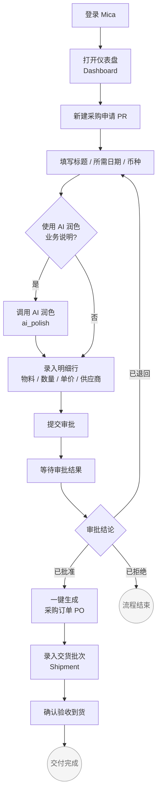
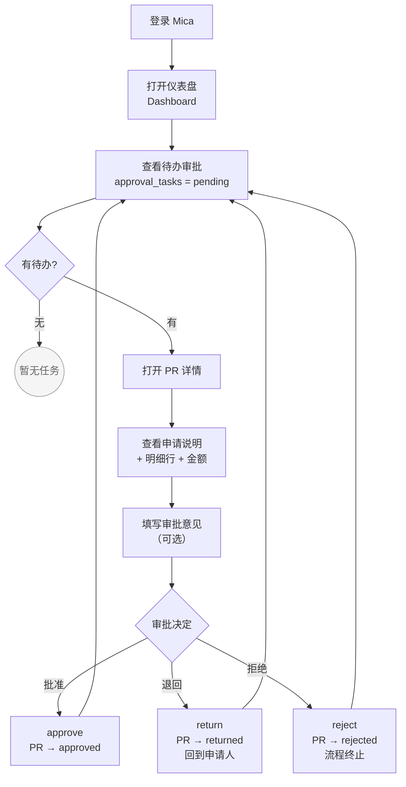
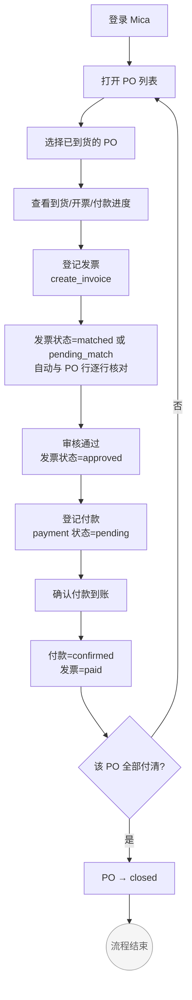
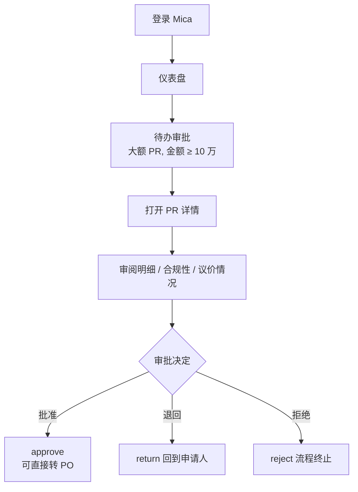
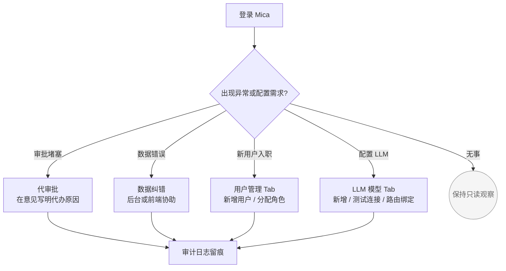

# 第 3 章｜按角色工作流

> Mica（觅采）用户手册 · 第 3 章

登录后请先在顶栏确认你的角色标签。本章按角色拆分，找到你的角色跟着做即可。

本章为五类用户各写了一份"一天的工作指引"——不讲底层数据模型，也不按前端菜单罗列，而是按你在工位前从早到晚的真实动作铺开：早上打开 Mica 先看哪里、哪个按钮承接下一步、出了什么情况走哪条岔路。只要能在顶栏识别出自己的角色标签，就可以跳到对应的 H2 章节按部就班。

> **关于按钮名称**
> Mica 支持中英双语（zh-CN / en-US）。本章按钮名统一写作"中文 English"形式，例如"**新建 Create**"、"**提交审批 Submit for Approval**"。你看到的实际文案取决于语言切换器的当前选项，但点击的是同一个按钮。
>
> **关于截图**
> 本章用 `[截图：xxx]` 方括号占位标记位置，正式版手册发布前会补充真实界面截图。

---

## IT 采购员 (it_buyer) 工作流

### 你的职责

你是整个采购主线的**发起人**。日常工作是收集内部用人部门的采购需求、录入为规范的采购申请（PR），盯着审批进度、审批通过后一键转订单，再跟进供应商交货与验收。你直接对接供应商，也是后端数据最重要的生产者。

### 你能看到的菜单

- **仪表盘 Dashboard** — 个人工作台，查看我发起的 PR、待跟进的 PO、到货提醒
- **采购申请 Purchase Requisitions** — 我创建或相关的 PR 列表
- **采购订单 Purchase Orders** — 我相关的 PO 列表与进度
- **合同 Contracts** — 我负责的 PO 对应合同（可查看 + 上传扫描件 + OCR 检索）
- **交货批次 Shipments** — 所有到货批次，按 PO 归并
- **SKU 行情 SKU Pricing** — 物料历史价格 + 录入报价 + 异常提醒

> 注意：你**看不到**「待办审批」「付款记录」「发票」这三个菜单——审批由部门负责人 / 采购经理承接，付款与发票由财务审核负责。

### 典型一天

我们以一个具体案例贯穿：**Alice 是 IT 采购员，今天要为新入职的 3 名研发同事采购 MacBook Pro 16 寸**。

1. **登录 Mica**
   - 在 `http://mica.<公司域名>` 输入账号密码（或走 SSO 跳转）。
   - 登录后默认落在**仪表盘 Dashboard**。先确认顶栏右侧角色标签显示 **IT 采购员 / IT Buyer**。

2. **打开仪表盘，扫一眼今日状态**
   `[截图：IT 采购员仪表盘]`
   - 看"我的采购申请"卡片：是否有被退回（returned）的 PR 需要修改？
   - 看"我的采购订单"卡片：是否有"已到货未登记"的提醒？
   - 今天要做新单，所以这两个暂时没有任务，直接开始。

3. **进入采购申请页，点击「新建 Create」**
   - 左侧菜单点击**采购申请 Purchase Requisitions**，跳到列表页。
   - 右上角点击**新建 Create** 按钮，进入 PR 新建表单页。

4. **填写头部字段**
   - **标题 Title**：填"新员工 MacBook Pro 16 采购 x3"。
   - **所需日期 Required Date**：选两周后（要给审批和采购留时间）。
   - **币种 Currency**：默认 CNY，不动。

5. **用 AI 润色业务说明**
   - 在**业务说明 Business Reason** 框粗略敲几句："3 个新人入职，研发岗，需要 MBP 16。"
   - 点击输入框旁边的**AI 润色 AI Polish** 按钮。
   - 系统调用 LLM 把草稿改写成更规范、更有说服力的描述（例如补充用人部门、技术要求、对比机型等），审批人会更容易理解背景。
   - 对 AI 生成的版本扫读一遍，不满意可以点**重新生成 Regenerate**；觉得过度发挥也可以直接在框里手工改。

6. **录入明细行**
   - 滚动到**明细 Items** 区域，点**新增行 Add Row**。
   - 填入物料名（MacBook Pro 16）、规格（M3 Pro / 36GB / 1TB）、数量（3）、单价（约 ¥22,000）、供应商（Apple 官方渠道）。
   - 系统自动累加**总金额 Total Amount**，这里约 ¥66,000（低于 10 万的部门审批阈值）。

7. **保存草稿还是直接提交？**
   - 若细节还没定（单价待询价），点**保存草稿 Save Draft**——PR 进入 `draft` 状态，随时可回来继续编辑，不会触发审批。
   - 若信息齐备，直接点**提交审批 Submit for Approval**——PR 进入 `submitted` 状态，系统根据金额自动路由审批人：
     - 金额 < ¥100,000 → 路由给**同部门的部门负责人**（本例即 Alice 部门的 Bob）
     - 金额 ≥ ¥100,000 → 路由给**采购经理**

8. **等待审批结果**
   - 提交后页面回到 PR 详情，顶部状态徽标显示"待审批 Submitted"。
   - 你什么都不用做，关掉去忙别的事。**系统会在 Header 铃铛自动提醒审批结果**（v0.5 通知中心）。飞书推送在 v0.6 路线图中。
   - 过一会儿回来刷新详情页，状态可能变为：
     - **已批准 Approved**：恭喜，走第 9 步。
     - **已退回 Returned**：审批人觉得有小问题需要你改。页面会显示审批人的意见。修改后再点**提交审批 Submit for Approval** 重新走流程。
     - **已拒绝 Rejected**：根本性反对，流程终止。和审批人沟通后如确需采购，开一张新 PR 即可。

9. **批准后：一键生成采购订单**
   - 在已批准的 PR 详情页，右上角出现**生成采购订单 Convert to PO** 按钮。
   - 点击后系统从 PR 明细生成 PO，自动分配 PO 单号（如 `PO-2026-0001`），页面跳到订单详情页。
   - PR 状态变为 `converted`（归档），后续的交货、付款都围绕 PO 展开。

10. **进入采购订单详情，和供应商对接**
    - 下单给 Apple，约定两周内交付。把 PO 号发给供应商；合同由采购经理或管理员发起签署（见对应章节）。
    - 在 PO 详情页的**概览 Overview** 标签可随时看到总量、已收货量、已付款量。

11. **登记到货批次（Shipment）**
    - 两周后收到 3 台机器，打开 PO 详情页，切换到**交货批次 Shipments** 标签。
    - 点**登记交货 Record Shipment**，弹出表单 Modal：
      - 批次号 Batch No（默认递增）
      - 承运商 Carrier、运单号 Tracking Number（可留空）
      - 实际到货日期 Actual Date
      - 每行明细的**本批次到货数量 Qty Shipped**
    - 一次到齐 3 台：第 1 批次填"MacBook Pro 16 × 3"，保存即可。
    - **多批次场景**（简短说明）：例如供应商分两次发货，第一批 2 台、第二批 1 台，就先建批次 1 填数量 2，等第二批到货再回到这里**再次点击登记交货 Record Shipment**，新建批次 2 填数量 1。系统会根据累计到货量把 PO 状态从 `partially_received` 流转到 `fully_received`。

12. **查进度，交付完成**
    - 回到 PO 详情概览，确认"已收货量 = 订单总量"，PO 状态为 `fully_received`。
    - 后续的付款、发票由财务审核处理，你不用再介入。至此这一单对 Alice 来说已闭环。

### 权限边界

> **IT 采购员能做的动作仅限"发起与执行"，以下动作你做不了：**
>
> - **审批 PR**（Approve / Reject / Return）— 这是部门负责人（小额）或采购经理（大额）的职责；你甚至不会在菜单里看到"待办审批 My Approvals"。
> - **登记付款、确认付款** — 财务审核的职责；你在 PO 详情页也看不到**登记付款 Record Payment** 按钮。
> - **登记发票、维护发票** — 财务审核的职责。
> - **查看其他 IT 采购员名下的 PR/PO 明细** — 行级权限限制你只能看到"与自己相关"的记录（你作为申请人 / 创建人 / 相关参与者）。
> - **修改公司 / 部门 / 用户 / 审批阈值** — 管理员职责。

### 流程图

[图 5 · IT 采购员日常工作流](./_diagrams.md#5-it-采购员日常工作流)——完整图见 `_diagrams.md` 文件第 5 节。

### 常见问题

1. **PR 保存草稿后还能删除吗？**
   可以。草稿（draft）状态的 PR 在详情页有**取消 Cancel** 按钮，点击后 PR 转为 `cancelled`，不占用单号序列的再使用，但历史记录仍保留以便审计。已提交（submitted 及以后）的 PR 不能直接删除，只能走"退回 → 修改"或"拒绝"路径。

2. **AI 润色的内容会自动保存吗？我需要手动确认吗？**
   AI 润色按钮会直接把新内容写进**业务说明 Business Reason** 输入框，但 PR 整体只有你点击**保存草稿 Save Draft** 或**提交审批 Submit for Approval** 后才真正落盘。所以你可以反复润色、比较，直到满意再提交。

3. **PR 批准后发现明细填错了怎么办？**
   一旦 PR 进入 `approved` 状态，你无法再修改明细。正确做法是：先**取消 Cancel** 这张 PR（进入 `cancelled`），再开一张新 PR。如果已经**生成采购订单 Convert to PO**，就要联系采购经理或管理员协助处理订单层的修正。养成习惯：提交前复核一次明细。

4. **提报价格前想先查历史行情怎么办？**
   打开左侧菜单 **SKU 行情 SKU Pricing** → 选择对应物料，系统展示 90 天滚动基准价（均值、中位、最低、最高、标准差、样本数）和完整时间序列。如果发现你新拿到的报价显著偏离基准，值得和供应商再谈一轮。拿到新报价后也别忘了点 **录入报价 Record Price** 沉淀进系统，你和团队以后都能复用。

---

## 部门负责人 (dept_manager) 工作流

### 你的职责

你是本部门采购的"小额守门员"。对本部门同事提交的 PR 做出批准 / 退回 / 拒绝的决定——金额 < ¥100,000 的 PR 会自动落到你手上，大额会直接走采购经理。你代表部门为这笔开销背书，意味着认可**预算归属、采购必要性、费用合理性**。

### 你能看到的菜单

- **仪表盘 Dashboard** — 顶部会显示待办审批红点计数
- **待办审批 My Approvals** — 你的核心工作页，列出所有 `pending` 状态的审批任务
- **采购申请 Purchase Requisitions** — 本部门 PR 只读查看，用于回溯历史
- **采购订单 Purchase Orders** — 本部门 PO 只读查看，跟踪执行情况
- **合同 Contracts** / **交货批次 Shipments** — 本部门范围只读

> 你**看不到**「付款记录」「发票」这两个菜单——财务执行不在你职责范围内。

### 典型一天

案例：**Bob 是某部门负责人，Alice 向他提交了上节那张 MacBook Pro 采购 PR**。

1. **登录 Mica，看顶栏红点**
   - 登录后看**待办审批 My Approvals** 菜单右边是否有红色数字徽标，本例显示 `1`。
   - 也可以在仪表盘的"待办审批"卡片看到汇总数量。

2. **进入待办审批页**
   - 点击**待办审批 My Approvals**，列表显示所有待你处理的任务。每行显示：单号、申请人、标题、金额、提交时间。
   - 按提交时间倒序，最新在顶。

3. **点击单号进入详情**
   - 点 Alice 那张 PR 的单号，跳到 PR 详情页（同一个详情页，但你的视角带有审批操作区）。
   - 重点看四块内容：
     - **业务说明 Business Reason** —— 采购目的是否合理？
     - **明细 Items** —— 物料、数量、单价是否对得上业务？
     - **总金额 Total Amount** —— 在本部门月度预算里消化得了吗？
     - **所需日期 Required Date** —— 时间是否急迫？
   - 页面底部是**审批意见 Comment** 输入框与三个操作按钮。

4. **三选一：处置这张 PR**
   审批有三种动作，对应不同语义：

   | 动作 | 按钮 | 语义 | 结果状态 | 后续路径 |
   | :--- | :--- | :--- | :--- | :--- |
   | **批准** | **批准 Approve** | 我认可这笔开销，部门预算承担 | `approved` | 申请人可转 PO |
   | **退回** | **退回 Return** | 有小问题需要修改后再交（如物料规格、金额不合理） | `returned` | 回到申请人手里，修改后重新提交 |
   | **拒绝** | **拒绝 Reject** | 根本性反对（非必要、不符合制度、方向错误） | `rejected` | 流程终止，申请人如需采购需开新单 |

   - **务必先填审批意见 Comment**，特别是退回 / 拒绝——申请人看到意见才知道怎么改或为什么被否。
   - 然后点击对应按钮。系统弹确认 Modal，确认后审批完成，任务从你的待办列表消失。

5. **退回后会怎样**
   - 假设 Bob 觉得"MacBook Pro 16 寸对新人略奢侈，建议降到 14 寸"，点**退回 Return** 并在意见里写明理由。
   - PR 状态变为 `returned`，Alice 的仪表盘会提醒她有退回任务。
   - Alice 修改明细（换成 14 寸）后，再点**提交审批 Submit for Approval**，PR 重新进入 `submitted`、再次路由到 Bob 的待办。Bob 再次审阅，这次可能选择批准。

### 权限边界

> **部门负责人的权限仅限"审阅与决定"，你不能做的事：**
>
> - **创建 PR** — 你不是发起人，采购菜单里没有**新建 Create** 按钮。即便 IT 采购员临时休假，你也不能替他开单，需要让管理员协助。
> - **修改他人 PR 明细** — 审阅时你看到的是只读视图。发现问题只能用"退回 Return"请申请人自己改，不能直接动手。
> - **审批其他部门的 PR** — 行级权限把你的待办严格限制在本部门申请人的提交上；跨部门的单子你既看不到也不会路由给你。
> - **审批大额 PR（≥ ¥100,000）** — 这些单子会自动跳过你，直接路由给采购经理；不会出现在你的待办里。
> - **登记付款 / 发票** — 财务审核职责。

### 流程图

[图 6 · 部门负责人审批工作流](./_diagrams.md#6-部门负责人审批工作流)

### 常见问题

1. **批准后我能反悔吗？**
   不能直接撤销。一旦你点下**批准 Approve**，PR 变为 `approved`，后续可能立即被转成 PO。如果真的误点，请联系采购经理 / 管理员，在 PO 层面处理（取消订单 Cancel PO）。所以养成**先填意见、再点按钮**的习惯，给自己半秒冷静期。

2. **退回 Return 和拒绝 Reject 到底怎么选？**
   - **退回**：问题可修（金额写错一位、规格要调、业务说明单薄），你希望申请人改完重交。申请人收到后可以编辑再提交。
   - **拒绝**：问题根本无法修（不符合制度、预算已满、方向错误），你希望流程彻底结束。申请人如坚持采购，只能另外发起新单并重新组织理由。
   - **简记**：退回是"回去改"，拒绝是"到此为止"。

3. **我休假时待办怎么办？审批会堵吗？**
   **v0.5 起支持审批代理人**。你可以在出差前创建一条"代理人规则"（`POST /api/v1/approval-delegations`，或通过 Admin 控制台），指定**时间段 + 受托人 + 原因**，在该时间段内你的审批任务会自动路由给受托人。任务回归前可随时**软撤销**（revoke）。管理员也可以替你创建。结合 v0.5 新增的多级串签，审批链不再因单点缺勤而堵塞。

---

## 财务审核 (finance_auditor) 工作流

### 你的职责

你是业务链路的"财务执行与留痕"角色。在货到之后，依次把发票、付款登记入账、做三单比对、跟踪到 PO 关闭。你**不**发起采购、也**不**审批业务 PR，但你是财务侧唯一能触发"钱出去了"动作的角色。

### 你能看到的菜单

- **仪表盘 Dashboard** — 看到今日到期付款、待开发票的 PO 概览
- **采购申请 Purchase Requisitions** — 全量只读（你可以看到任一 PR 的金额、明细、审批记录）
- **采购订单 Purchase Orders** — 全量只读 + 可触发付款 / 发票登记
- **合同 Contracts** — 全量只读
- **交货批次 Shipments** — 全量只读（核对到货量）
- **付款记录 Payments** — 你的主工作页
- **发票 Invoices** — 你的主工作页

> 你的菜单是五类角色中**最"宽但浅"**的：看得最全，但手能动的操作只集中在付款和发票两块。

### 典型一天

财务没有"全流程跑一单"的节奏，而是**并发处理多个 PO 的财务动作**。典型一天的三个场景：

1. **登录后先看仪表盘的财务卡片**
   - 顶栏角色标签确认为**财务审核 Finance Auditor**。
   - 仪表盘"付款记录"卡片：今天有多少笔 `pending` 待确认？
   - 仪表盘"发票"卡片：有多少张 `matched` / `pending_match` 待审核、`approved` 等待付款？

2. **场景 A：登记一张发票**
   - 收到供应商寄来的发票原件。
   - 左侧点**发票 Invoices**，在列表右上角点**登记发票 Record Invoice**（或从某张已到货的 PO 详情页进，更方便关联）。
   - **必须上传发票原件（PDF / OFD / XML / 图片）**——系统会自动识别发票号、开票日期、税号等字段并预填，你只需核对。AI 识别的来源与置信度显示在按钮右侧（例如 `XML · 99%` / `Vision · 86%`）。不支持的格式可以手动填写，但原件必须上传作为凭证。
   - 发票表单 Modal 打开（字段已被预填，请逐项核对）：
     - 发票号 Invoice Number、开票日期 Invoice Date、供应商 Supplier
     - 金额 Total Amount、税额 Tax Amount
     - 明细行：可勾选本发票覆盖**哪些 PO 的哪些行**
   - **跨 PO 发票场景**：一张发票对应多个 PO 是可能的（如同一供应商给你集中开票两个月的订单）。在发票明细区切换"关联 PO"时可以多选，系统会按 PO 行逐条对账。
   - 保存后发票状态为 `matched`（所有产品行都有对应 PO item 且不超额）或 `pending_match`（有超额 / 无 PO 对应 / 杂费行）。超额不阻断提交，但会以 `warn` 返回给你，`is_fully_matched=false` 并等待人工复核（当前实现已能覆盖 95% 常见场景，完整三单匹配在后续迭代中精细化）。

3. **场景 B：审核发票并登记付款**
   - 在**发票 Invoices** 列表筛 `pending_match`，点进某张发票详情。
   - 核对发票原件与系统录入一致，点**审核通过 Approve**，发票转 `approved`。
   - 紧接着点**登记付款 Record Payment**（也可以从 PO 详情页的付款标签发起），付款表单 Modal：
     - 期数 Installment No（支持分期付款）
     - 金额 Amount、付款方式 Payment Method（银行转账 / 支票 / …）
     - 到期日 Due Date、付款日 Payment Date
     - 交易流水号 Transaction Ref
   - 保存后生成付款记录（`pending` 状态）。

4. **场景 C：标记付款已到账**
   - 收到出纳回执 / 网银截图后，回到**付款记录 Payments** 列表，找到刚建的那笔。
   - 点**标记已付款 Mark Paid**，付款记录转 `confirmed`，对应发票状态自动联动为 `paid`。
   - 回到 PO 详情，系统会根据累计付款金额判断：PO 全部付清、全部验收完毕后，状态可流转到 `closed`。

### 权限边界

> **财务审核的视角是"宽看、窄动"，你不能做的事：**
>
> - **创建或修改 PR / PO / 合同 / 交货批次** — 在 PR / PO 详情页你能看到全部字段但**看不到修改按钮**（没有"编辑 Edit"、没有"新建 Create"）。你的视角是审核者视角。
> - **审批 PR** — 业务审批不在财务职责；审批动作只向 `dept_manager` / `procurement_mgr` 开放。
> - **替供应商补登记收货** — 收货由 IT 采购员登记，你只核对数据，不能替代录入。
> - **跨公司查看** — 行级权限仍按你所属的公司过滤。若组织跨多法人经营，需为每家公司分别建账号或由管理员开授权。

### 流程图

[图 7 · 财务审核员工作流](./_diagrams.md#7-财务审核员工作流)

### 常见问题

1. **发票金额和 PO 对不上怎么办？**
   系统会把发票标为 `pending_match`（有产品行未匹配 PO 或超额）。你需要和 IT 采购员 / 供应商沟通：要么让供应商重开发票，要么核实 PO 行是否需要调整单价 / 数量。在 `pending_match` 状态下**不要**强行审核通过——这是三单匹配留给人工介入的关键缓冲点。

2. **同一张 PO 可以分几次开票、分几次付款吗？**
   可以。一张 PO 对应多张发票（按到货批次开票很常见），也对应多笔付款记录（分期付款或预付款 + 尾款）。系统按"累计已开票 / 累计已付款"与 PO 总额比对，无需人工汇总。

3. **我误点了「标记已付款 Mark Paid」，怎么撤销？**
   当前版本**没有自助回滚**通道。请联系管理员在后台协助修订，并在付款记录的**备注 Notes** 里说明原因，保持审计轨迹。为避免误操作，建议在点按钮前用付款流水号和网银回执做最后一次核对。（v0.5 起可在 Payments 列表点"导出 Excel"下载对账表与网银流水核对。）

---

## 采购经理 (procurement_mgr) 工作流

### 你的职责

你是采购条线的"大额守门人 + 全局大脑"。三件事：一是审批所有金额 ≥ ¥100,000 的大额 PR；二是维护采购全局视图（跨部门、跨项目跟踪）；三是合同的审核把关。你与部门负责人做的动作类似，但你面对的是公司级别的大单和战略性物资。

### 你能看到的菜单

- **仪表盘 Dashboard** — 待办大额审批、公司级采购总览
- **待办审批 My Approvals** — 大额 PR 的审批任务
- **采购申请 Purchase Requisitions** — 全公司 PR（跨部门）
- **采购订单 Purchase Orders** — 全公司 PO（跨部门）
- **合同 Contracts** — 全公司合同（含扫描件归档 + OCR 全文检索 + 到期提醒）
- **交货批次 Shipments** — 全公司交货
- **SKU 行情 SKU Pricing** — 物料价格基准 + 异常预警
- （财务相关菜单你看不到）

### 典型一天

1. **登录后查看大额审批待办**
   - 顶栏确认角色标签为**采购经理 Procurement Manager**。
   - 进入**待办审批 My Approvals**，这里只会出现金额 ≥ ¥100,000 的 PR——中小额的根本不会路由给你。

2. **审阅大额 PR**
   - 与部门负责人的审阅流程几乎一致（参见上节步骤 3–4），但关注点不同：
     - 是否与供应商谈过更好的价格？（大额有议价空间）
     - 是否走过招投标或比价？（合规性）
     - 合同模板是否准备好？
   - 同样三选一：**批准 Approve** / **退回 Return** / **拒绝 Reject**，务必先填**审批意见 Comment**。

3. **批准后协助转 PO**
   - 采购经理本人也有权直接在 PR 详情点**生成采购订单 Convert to PO**，这对"申请人是 IT 采购员但流程想直接由采购经理统一推进"的大单很有用。

4. **巡视全局 PO 与合同**
   - 切到**采购订单 Purchase Orders**：查看全公司在途 PO，关注逾期、延期交付的订单。
   - 切到**合同 Contracts**：审核合同条款、到期提醒。合同详情页有**审核 Review** / **补充条款 Amend** 等操作。**v0.5 起**系统到期前 30 天会自动在通知中心推送"合同即将到期"提醒；到期阈值可在 Admin 控制台"系统参数"中调整（`contract.expiry_reminder_days`）。详细合同版本管理、电子签、续签流在 v0.7+ 规划。

5. **异常复核**
   - 在**采购申请 Purchase Requisitions** 或**采购订单 Purchase Orders** 列表中，可以用筛选找"单价异常"的记录。
   - **SKU 行情 SKU Pricing**（v0.4.2 上线）：这里自动汇总近 90 天基准价并识别偏离 ±20% 的异常报价。顶部橙色预警条展示所有未确认异常，进采购经理视角重点关注 `critical` 级（偏离 ≥ 40%）——这些可能意味着供应商涨价信号、询价失准、或录入错误。点每条"已知悉"归档前，先调查清楚。

6. **合同审核与到期巡视**
   - **合同 Contracts** 列表顶部提供：
     - **搜索框**：按标题 / 编号 / 扫描件 OCR 文本全文检索
     - **30 天内到期预警**：橙色卡片自动列出即将到期的合同，你可以决策续签或归档
   - 点合同号进详情页，可以上传签署件 PDF/OFD/XML/扫描图，系统自动 OCR 入库便于后续搜索。

### 权限边界

> **采购经理是"采购条线的准管理员"，但仍有边界：**
>
> - **审批小额 PR（< ¥100,000）** — 这些单子不会路由给你；如果某个部门负责人休假，管理员可协助兜底，不应由你默认接手。
> - **登记付款 / 发票** — 财务职责。你能在 PO 详情页看到付款和发票进度，但看不到**登记付款 Record Payment** / **登记发票 Record Invoice** 按钮。
> - **系统配置（用户、阈值、AI 路由）** — 管理员专属，不在采购经理职责内。

### 流程图

采购经理的审批流程与部门负责人相同，只是作用于大额通道，可复用图 6（仅把"申请人部门"替换为"全公司跨部门"的范围理解）：

### 常见问题

1. **采购经理和部门负责人能同时审批同一张 PR 吗？**
   **v0.5 起支持多级串签**。默认规则（`approval_rules` 种子）：金额 < ¥100,000 → 部门负责人单级；≥ ¥100,000 → 部门负责人 → 采购经理两级（前一级通过后自动流转到下一级）。管理员可在 Admin 控制台编辑 `approval_rules` 添加新阶段（如"财务总监"第三级）或新业务类型（如 `contract` / `payment`）。金额阈值也可在"系统参数"→ `approval.amount_threshold_cny` 调整。

2. **我能主动把一张路由错了的 PR 拉到自己名下吗？**
   不能直接拉。若某 PR 金额接近阈值但判断应由你审批，请让申请人调整明细后重新提交，或让管理员代为调整路由。

3. **合同模块什么时候完善？**
   v0.4.2 合同模块已支持扫描件归档 + OCR 全文检索 + 到期提醒；**v0.5 起**合同到期提醒会自动推送至通知中心，`current_version` 字段支持多版本追踪。完整合同版本管理、电子签、续签流程在 v0.7+ 迭代。

---

## 管理员 (admin) 工作流

### 你的职责

你拥有系统全部权限的"兜底"角色——五类业务角色的动作你都能做，但**默认不参与业务线**。核心工作是维护系统配置（公司、部门、用户、审批阈值）、应急兜底（代审批、纠错、审计），以及后续版本的高级配置（AI 路由、LLM 模型）。

### 你能看到的菜单

五个业务角色的菜单你都能看到，再加上管理员控制台：

- **仪表盘 Dashboard**
- **待办审批 My Approvals**（作为审批人的兜底候选）
- **采购申请 / 采购订单 / 合同 / 交货批次 / 付款记录 / 发票** — 全量可见
- **系统管理 Admin Console** — 仅管理员可见，六个 Tab：系统参数、LLM 模型、AI 场景路由、用户管理、AI 调用日志、审计日志（详见 [04 · 功能参考 · 管理员控制台](./04-features.md#管理员控制台)）

### 典型一天

1. **登录后打开系统管理**
   - 顶栏确认角色标签为**管理员 Admin**。
   - 左侧菜单点**系统管理 Admin Console**。仪表盘上出现的 PR/PO 红点只在需要兜底时才去关注。

2. **首次配置 LLM 模型**（新部署、换供应商、加新模型时）
   - 进入**LLM 模型 LLM Models** Tab → 点**新增 New**。
   - 填写 `name`（显示名）、`provider`（如 `dashscope`）、`model_string`（LiteLLM 格式，如 `dashscope/qwen-max`）、`api_key`（保存后脱敏显示为 `sk-12****xxxx`，Fernet 加密入库）、`modality`（`text` / `vision` / `ocr` / `embedding`）。
   - 点**测试连接 Test Connection**，查看返回的 `success` / `latency` / `model_response`——有 `success=true` 才算真正可用。
   - 保存。

3. **给发票识别场景绑定视觉模型**
   - 切到**AI 场景路由 AI Routing** Tab。
   - 找到 `feature_code = invoice_extract`，把主模型改为刚新建的视觉模型，按需配置降级链（主模型挂了时的备选）。
   - 保存后财务再登记发票，扫描件就会走真实的 LLM Vision 而不是 mock。

4. **查看今日 AI 使用情况**
   - 切到**AI 调用日志 AI Call Logs** Tab。
   - 顶部卡片按 feature 聚合 7 日内的调用量、token 总量、平均延迟，一眼看出哪个 feature 耗量最大。
   - 下方列表展开单条调用：用户、模型、延迟、`status`（`success` / `error`）、错误信息。异常调用可据此回溯。

5. **用户离职或入职**
   - 切到**用户管理 Users** Tab。
   - 新用户：点**新增**，填用户名、邮箱、角色、初始密码。
   - 离职用户：找到用户 → 重置密码或停用账号。顺手在审计日志里核一遍该用户最近操作，确认没有异常。

6. **排查业务问题：看谁改了什么**
   - 有人反馈"供应商信息被改了我不知道是谁"之类的问题，进**审计日志 Audit Logs** Tab。
   - 按**事件类型前缀**（如 `supplier.`）、**资源类型**（如 `supplier`）、**时间范围**收敛。
   - 锁定操作人后在**用户管理** Tab 交叉比对登录时间，还原事件经过。

7. **代审批（兜底）**
   - 某部门负责人休假，团队反映审批堵住了。
   - 进入**待办审批 My Approvals**，看到堆积的审批任务（代码层面：`admin` 可以处置任一 `pending` 任务，见 [`backend/app/services/approval.py:117-119`](../../backend/app/services/approval.py)）。
   - 逐条审阅、做出决定，在**审批意见 Comment** 里注明"代 XXX 审批"以便审计回溯。审计日志 Tab 里这些动作都有自动留痕。

8. **数据纠错**
   - IT 采购员反馈某张已批准的 PR 明细写错了。你可以在 PO 详情页做必要的调整（目前 v0.4 以取消重做为主要纠错方式，避免绕过审批链）。对误点**标记已付款 Mark Paid** 等场景，也由你协助后台修订，并在备注里写明原因。

### 权限边界

> **管理员没有业务层面的"不能做"——但有两条自律红线：**
>
> - **不要默认参与业务审批** — 业务角色（部门负责人 / 采购经理）在时，应让他们自己处理；管理员只在应急、兜底、纠错时介入。
> - **所有代操作必须留痕** — 代审批、代纠错时务必在意见 / 备注里写明原因，审计日志 Tab 会记录这些动作，便于后续追责。

### 典型流程图

由于管理员的职责偏"配置与兜底"而非业务主线，这里给出一张"何时介入"的决策图：

### 常见问题

1. **我是否应该用自己的管理员账号日常做采购？**
   **不建议**。管理员账号应保持"干净"——只用于配置与应急。如果你同时承担 IT 采购员工作，请另外申请一个 `it_buyer` 账号，这样业务日志、行级权限测试、审计回放都更清晰。

2. **如何新增一个用户？**
   在**系统管理 Admin Console → 用户管理 Users** Tab 点**新增**即可填表创建。如果需要批量导入或脚本化操作，仍可通过后端 CLI / 直接写入 `users` 表（需哈希密码）。

3. **管理员能看到其它角色看不到的敏感字段吗？**
   可以。字段级权限（见 [`backend/app/core/field_authz.py`](../../backend/app/core/field_authz.py)）对管理员放行所有字段，这也意味着管理员账号的泄露代价极大——请强制开启双因素或 SSO，并严格限制账号数量在 1–2 个。

---

> 文档版本：v0.4.0 · 更新日期：2026-04-21
