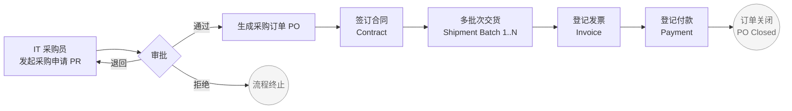
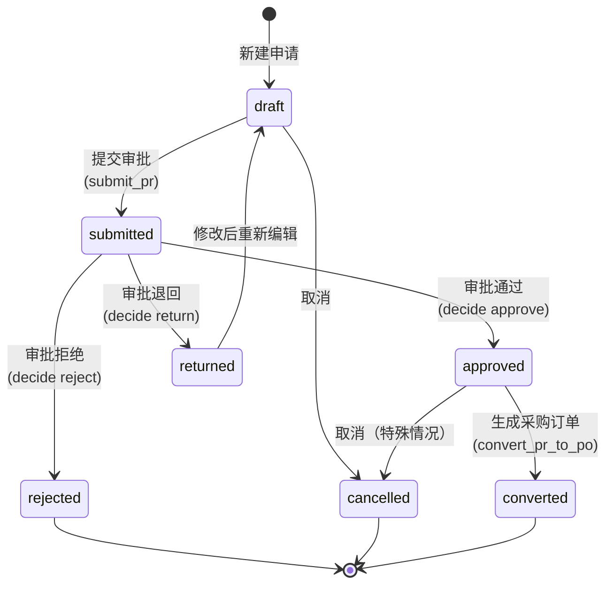
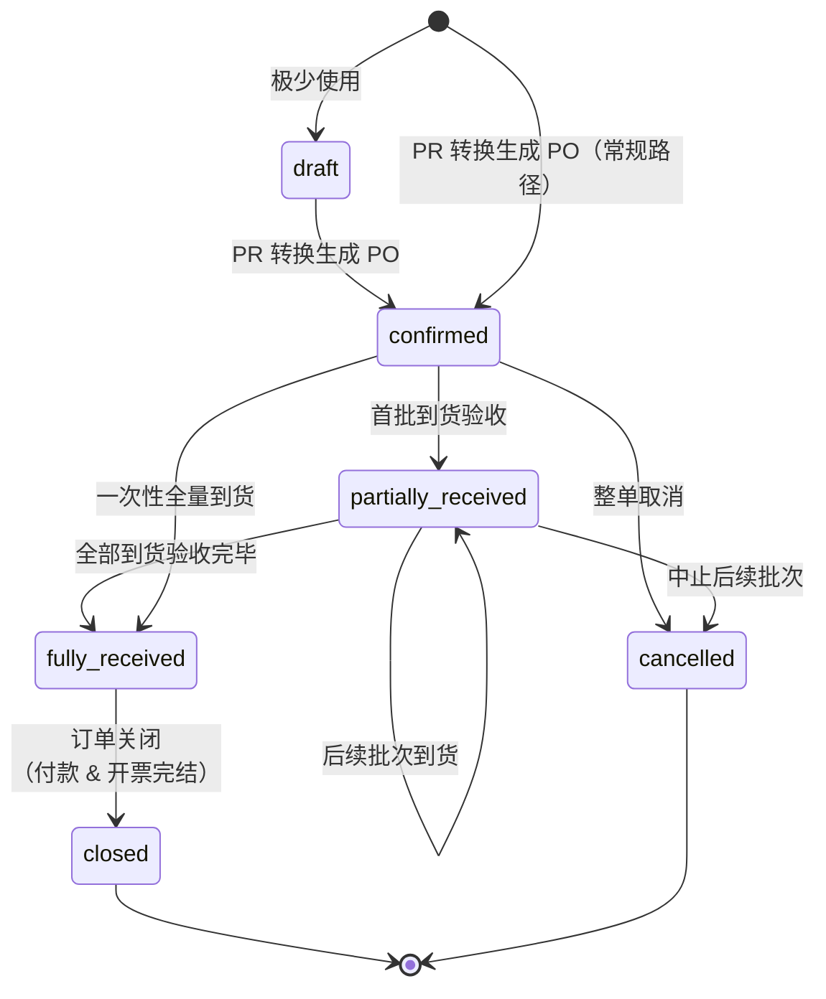
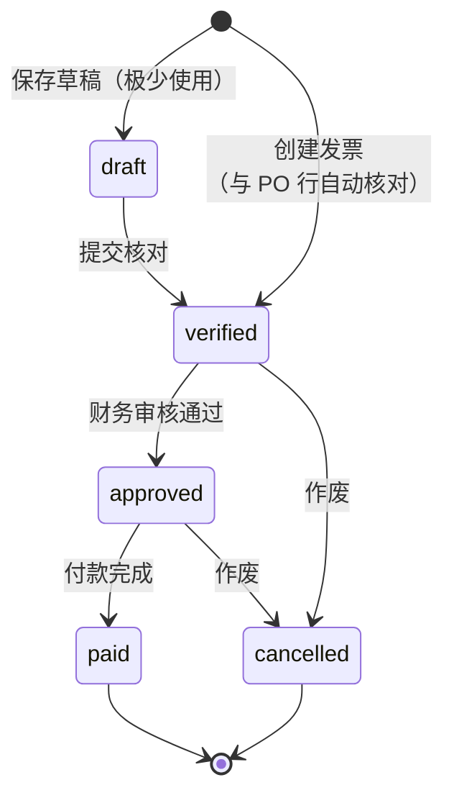
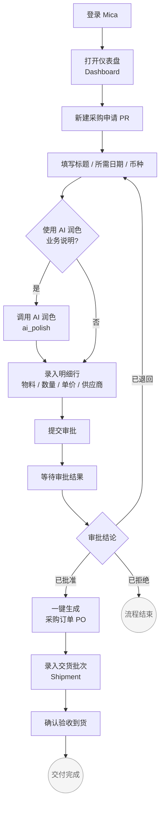
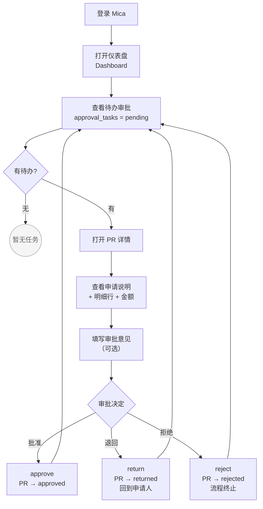
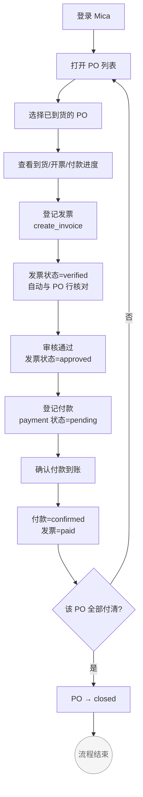
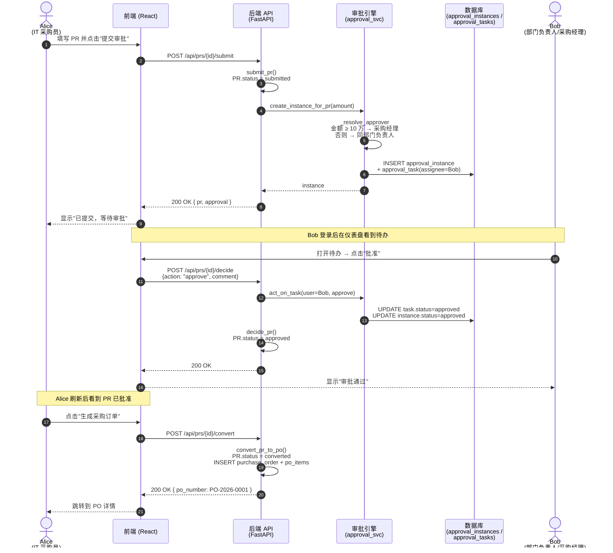
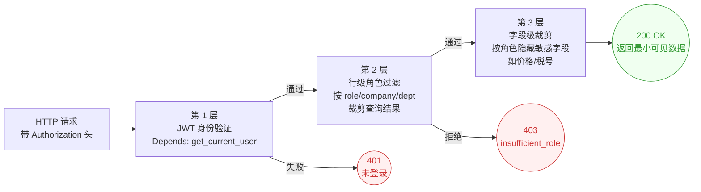
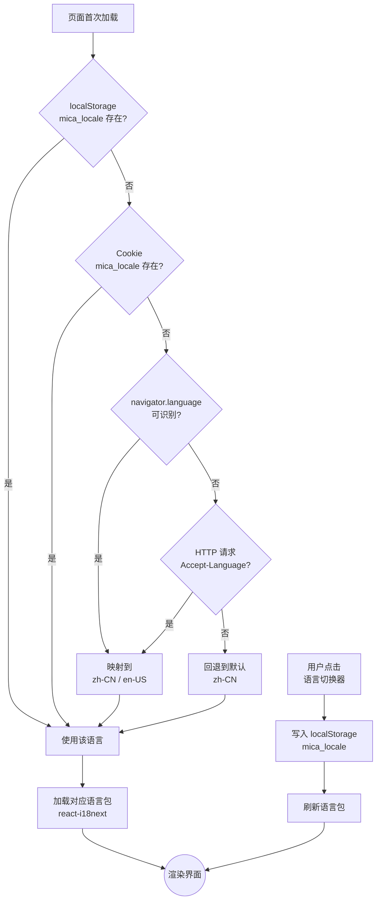

# Mica 流程图集

本文件集中存放《Mica 用户手册》所需的全部 Mermaid 流程图，供其它章节 include/引用。所有图均可在 GitHub 上原生渲染，无需外部图片资源。

图中节点文字以中文为主，首次出现的关键术语后附英文缩写，如"采购申请 (PR)"。版本基线：Mica v0.4（单级审批、发票 `draft → verified → approved → paid` 链路）。

---

## 1. 全局业务主线

该图展示 Mica 的端到端采购主线：从 **IT 采购员** 发起采购申请，经 **部门负责人 / 采购经理** 审批后生成采购订单，再依次产生合同、多批次交货、发票与付款。两条虚线分支分别表示审批被拒绝或退回后的回退路径。

---

## 2. 采购申请（PR）状态机

对应后端 `PRStatus` 枚举（见 `backend/app/models/__init__.py:34-41`）。一个 PR 从草稿起步，提交后进入待审批，审批人可做出三种决定；被退回后可回到草稿再次修改、再次提交；审批通过的 PR 在生成 PO 后进入终态 `converted`。

---

## 3. 采购订单（PO）状态机

对应后端 `POStatus` 枚举（`backend/app/models/__init__.py:44-50`）。PO 由审批通过的 PR 转换而来，默认进入 `confirmed`；随着交货批次陆续验收，状态在 `partially_received` 与 `fully_received` 间流转，最终可关闭归档。

---

## 4. 发票（Invoice）状态机 — 当前实现

v0.4 当前链路：发票创建即进入 `verified`（见 `backend/app/services/flow.py:398`，系统自动核对行项与 PO），随后财务审核员审批，审批通过后登记付款，付款确认后发票转为 `paid`。**注**：模型枚举中已预留 `pending_match / matched / mismatched`，计划在下一迭代改造为三单匹配链路，当前手册仅描述现行实现。

---

## 5. IT 采购员日常工作流

IT 采购员是系统的主要发起人。典型动作：登录 → 在仪表盘新建 PR → 调用 AI 润色业务说明 → 逐行录入明细 → 提交审批 → 等审批通过 → 一键转 PO → 登记到货批次。

---

## 6. 部门负责人审批工作流

部门负责人的核心动作是在仪表盘查看本部门的待办审批（对应 `approval_tasks` 表中 `assignee_id=本人 AND status=pending` 的条目），逐条审阅 PR 明细后做出决定。金额 ≥ 10 万 的申请会自动路由给采购经理，不会出现在部门负责人的待办里。

---

## 7. 财务审核员工作流

财务审核员在 PO 全部到货后进入：核对 PO → 登记发票（自动与 PO 行核对进入 `verified`）→ 审核发票（转 `approved`）→ 登记付款（`pending`）→ 确认付款（付款记录转 `confirmed`、发票转 `paid`）。

---

## 8. 时序图：提交 PR 到生成 PO

完整描述一次"发起 → 审批 → 转单"过程中前后端、审批引擎与两位用户（申请人 Alice、审批人 Bob）之间的交互。审批引擎内部按 `_resolve_approver` 规则解析审批人：`金额 ≥ 100000` 优先路由到采购经理（`procurement_mgr`），否则路由到同部门的 `dept_manager`，都找不到则兜底给 `admin`（见 `backend/app/services/approval.py:20-46`）。

---

## 9. 权限三层防御

Mica 对每次 HTTP 请求实施三层防御（概念示意，当前 v0.4 以应用层实现为主，Cerbos / Postgres RLS 作为后续版本的兜底通道）。任何一层放行失败即终止请求。

---

## 10. i18n 语言检测流程

前端在首次加载时按优先级链判定用户使用的语言，命中即止。一旦用户在界面上手动切换，新的选择会被写入 `localStorage`，后续访问直接命中第 1 步。

---

## 图索引

| 编号 | 图标题 | 类型 | 主要角色 / 对象 | 推荐引用章节 |
|----|------|----|---------------|----------|
| 1 | 全局业务主线 | flowchart LR | IT 采购员 / 审批人 / 财务审核 | 概述 · 业务全景 |
| 2 | 采购申请（PR）状态机 | stateDiagram-v2 | PR 对象 | 采购申请 · 状态说明 |
| 3 | 采购订单（PO）状态机 | stateDiagram-v2 | PO 对象 | 采购订单 · 状态说明 |
| 4 | 发票（Invoice）状态机 — 当前实现 | stateDiagram-v2 | Invoice 对象 | 发票与付款 · 当前实现 |
| 5 | IT 采购员日常工作流 | flowchart TD | IT 采购员 | 角色指南 · IT 采购员 |
| 6 | 部门负责人审批工作流 | flowchart TD | 部门负责人 / 采购经理 | 角色指南 · 审批人 |
| 7 | 财务审核员工作流 | flowchart TD | 财务审核 | 角色指南 · 财务审核 |
| 8 | 时序图：提交 PR 到生成 PO | sequenceDiagram | Alice（申请人）/ Bob（审批人）/ 系统 | 端到端示例 |
| 9 | 权限三层防御 | flowchart LR | 系统架构 | 附录 · 安全模型 |
| 10 | i18n 语言检测流程 | flowchart TD | 前端 / 用户 | 附录 · 多语言 |

---

> **维护约定**
> - 所有状态名、角色名应与 `backend/app/models/__init__.py` 中的枚举及 `frontend/src/i18n/locales/zh-CN/common.json` 中的文案保持一致。
> - 升级链路（如发票改为 `pending_match / matched / mismatched`）时，新增新版图并在此图索引追加一行，旧图标注"历史版本"而非直接删除，以便回溯既有手册。
